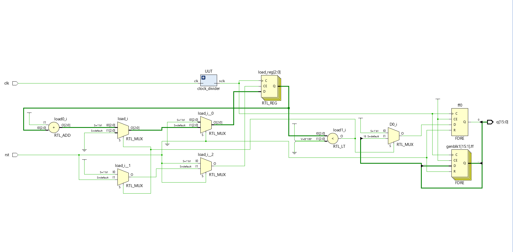
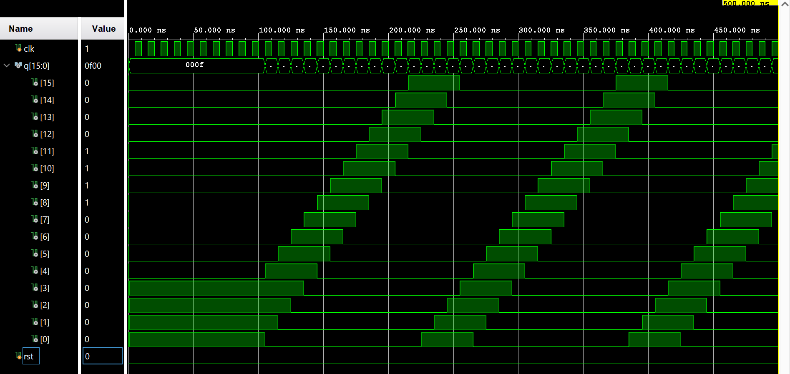
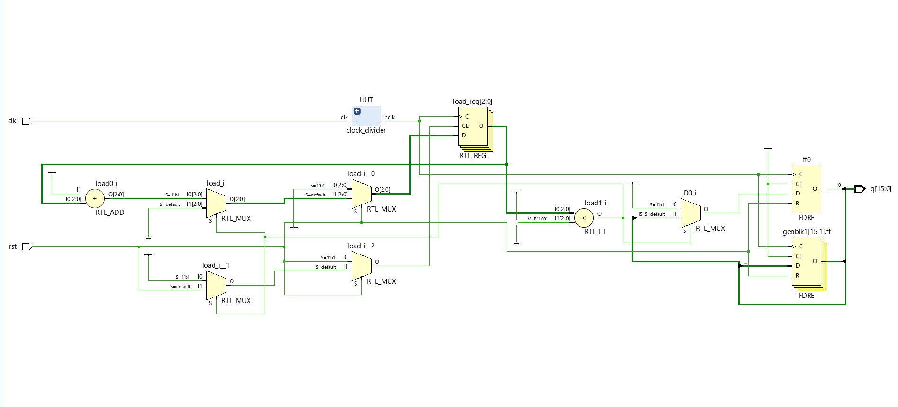
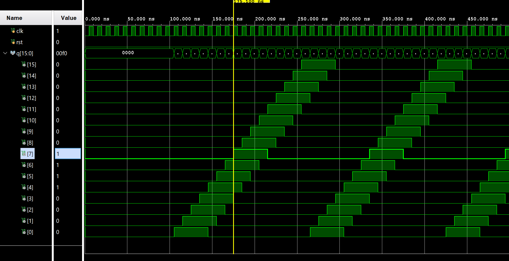

# Shifters and LED Pattern Modules

This project includes various shift register designs and creative LED display modules implemented using Verilog and tested on the Basys 3 FPGA board.

## Modules Implemented

- **SIPO (Serial-In Parallel-Out) Shift Register**
- **SISO (Serial-In Serial-Out) Shift Register**
- **4-bit Ring Shifter**
- **WeddingLight** (`pattern_1`) – Rotates 4 bits across 16 output LEDs
- **WeddingLight_2** (`pattern_2`) – Sequentially lights up 4 LEDs, then rotates them

All modules were simulated and tested using Vivado and verified on hardware using the Basys 3 board.

---

## Output Schematics and Waveforms

### 1. WeddingLight (Pattern 1)
#### Schematic

#### Output Waveform

---

### 2. WeddingLight_2 (Pattern 2)
#### Schematic

#### Output Waveform

---

## How It Works

- **SIPO:** Converts serial data to parallel format.
- **SISO:** Shifts data serially through a chain of flip-flops.
- **Ring Shifter:** Performs circular rotation on a 4-bit word.
- **WeddingLight (Pattern 1):** Cycles a 4-bit pattern through 16 LEDs in a loop.
- **WeddingLight_2 (Pattern 2):** Lights up 4 LEDs one by one, then rotates the lit pattern through 16 LEDs.

---

## Output Verification

### Simulation
- All designs were simulated in Vivado using custom testbenches.
- The waveforms were checked against expected shift behavior and LED activation patterns.

### FPGA Hardware Testing
- `WeddingLight` and `WeddingLight_2` were run on the **Basys 3 board**.
- LED patterns were visually inspected and confirmed to rotate/sequentially activate as designed.

